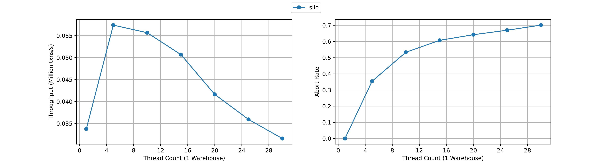
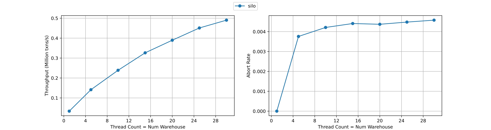

# tpcc-runner

A portable TPC-C benchmark for various in-memory database engines. 

# Description

tpcc-runner is yet another implementation of [TPC-C](http://www.tpc.org/tpcc/) which is a benchmark for online transaction processing systems.
TPC-C executes a mix of five different concurrent transactions of different types and complexity to measure the various performances of transaction engines.
Although TPC-C has its own problems, it is still one of the standard benchmarks used in academia along with the [YCSB](https://github.com/brianfrankcooper/YCSB) for concurrency control protocols.

# Motivation

tpcc-runner aims to provide an Open Source C++ implementation of in-memory TPC-C which __separates the implementation of transaction profiles from the transaction engine__.
As mentioned above, TPC-C will run transactions of five different profiles which are NewOrder, Payment, OrderStatus, Delivery, and StockLevel. 
Ideally these profiles should be independent from the backend transaction engine in the implementation level so that users can port these to different kinds of backends only by implementing the nessesary interfaces.
This is better not only in terms of usability but in terms of fairness as a benchmark.
Although there are already some implementations of TPC-C in C++ such as [tpccbench](https://github.com/evanj/tpccbench), these implementations tightly couples the transaction profiles with the backend so that it takes a lot of effort to customize them for uses in different backends.
To address this issue, tpcc-runner provides an implementation of TPC-C where transaction profiles are loosely coupled with the backend.

# Getting Started

## Dependencies
- Ubuntu 20.04
- g++ >= 10
- C++20 (for NAIVE protocol)
- C++17 (for SILO protocol)
## Build

Currently concurrency control protocols supported in this repository are
- NAIVE
  - a naive protocol that locks the whole database on exeuction
- SILO
  - a scalable multi-core optimistic concurrency control protocol

To build, 

```sh
mkdir build
cd build
cmake .. -DLOG_LEVEL=0 -DCMAKE_BUILD_TYPE=Release -DCC_ALG=SILO
make
```

Choose the protocol you want to compile in `-DCC_ALG=` argument.

## Execute
After building, the executable will be stored into the `build/bin` directory.
To execute, 

```sh
cd build/bin
./silo w t s
```

This will create tables with `w` warehouses and execute transactions using `t` threads for `s` seconds. For example, `./silo 2 5 20` will create tables with 2 warehouses and executes TPC-C using 5 threads for 20 seconds.

For more information on usage, see the docs directory.

# Performance

## NAIVE

Executing `./naive 1 1 20` yields the following output on `8 core Intel(R) Core(TM) i9-9900 CPU @ 3.10GHz` with `32GB RAM`

```
Loading all tables with 1 warehouse(s)
Loaded
1 warehouse(s), 1 thread(s), 20 second(s)
    commits: 2436911
    sys aborts: 0
    usr aborts: 11196
Throughput: 121845 txns/s

Details:
    NewOrder    c: 1089872(0.45%)   ua: 11196  sa:     0
    Payment     c: 1053197(0.43%)   ua:     0  sa:     0
    OrderStatus c:   97858(0.04%)   ua:     0  sa:     0
    Delivery    c:   98044(0.04%)   ua:     0  sa:     0
    StockLevel  c:   97940(0.04%)   ua:     0  sa:     0
```

Read more about performance in the docs directory.
## SILO

The performance of silo was measured for 3 seconds using `16 core Intel(R) Xeon(R) CPU E5-2630 v3 @ 2.40GHz`, 2 threads per core.

### Single Warehouse


In single warehouse, the performance scales until 5 threads. (The maxima of throughput could be in any number between 2 to 9 threads.) The performance degrades rapidly after that because of high contention. The abort rate is calculated as `num_aborts/num_trials = num_aborts/(num_aborts + num_commits)`. The abort rate approaches to 1 as the number threads increases.

### Thread Count = Num Warehouse



In `thread count = num warehouse`, the performance seems to scale well. The abort rate is much smaller than that of a single warehouse. The reason why silo scales is that it is cache-friendly (= it has fewer updates to shared memory). The OCC style read does not modify the shared memory when accessing data. The group commit (epoch) allows fewer updates to shared counter.

Reproducing this graph is possible by running `run_experiment.py` in the scripts directory. (Make sure to execute it in the base directory: `tpcc-runner/`)
# Author

Riki Otaki

# Licensing

[MIT License](https://github.com/wattlebirdaz/tpcc-runner/blob/master/LICENSE)